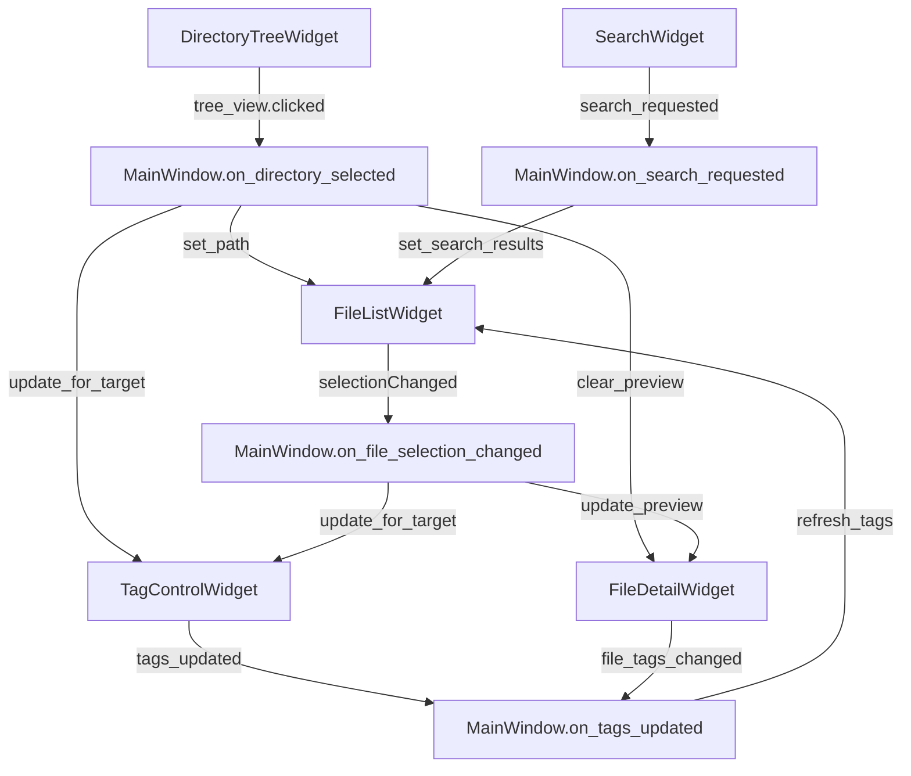

# Phase 0 분석 보고서 - 아키텍처 리팩터링 사전 분석

> **작성자**: 개발팀  
> **작성일**: 2025-01-13  
> **DRS 참조**: DRS-20250711-010 Phase 1 아키텍처 리팩터링  
> **분석 기간**: 3일  

---

## 1. 현재 코드 구조 완전 분석

### 1.1 Signal/Slot 연결 매핑 테이블

#### MainWindow의 시그널 연결 구조
```python
# main_window.py setup_connections()
self.actionExit.triggered.connect(self.close)
self.actionSetWorkspace.triggered.connect(self.set_workspace)
self.actionManageQuickTags.triggered.connect(self.open_custom_tag_dialog)
self.directory_tree.tree_view.clicked.connect(self.on_directory_selected)
self.directory_tree.filter_options_changed.connect(self._on_directory_tree_filter_options_changed)
self.file_list.list_view.selectionModel().selectionChanged.connect(self.on_file_selection_changed)
self.tag_control.tags_updated.connect(self.on_tags_updated)
self.file_detail.file_tags_changed.connect(self.on_tags_updated)
self.directory_tree.directory_context_menu_requested.connect(self.on_directory_tree_context_menu)
self.search_widget.search_requested.connect(self.on_search_requested)
self.search_widget.search_cleared.connect(self.on_search_cleared)
self.search_widget.advanced_search_requested.connect(self.on_advanced_search_requested)
```

#### 위젯별 시그널 정의
| 위젯 | 시그널 | 매개변수 | 설명 |
|------|--------|----------|------|
| `TagControlWidget` | `tags_updated` | `()` | 태그 변경 시 발생 |
| `TagChip` | `tag_removed` | `(str)` | 태그 삭제 시 태그 텍스트 전달 |
| `TagChip` | `clicked` | `()` | 태그 칩 클릭 시 발생 |
| `SearchWidget` | `search_requested` | `(dict)` | 검색 요청 시 조건 딕셔너리 전달 |
| `SearchWidget` | `search_cleared` | `()` | 검색 초기화 시 발생 |
| `SearchWidget` | `advanced_search_requested` | `(dict)` | 고급 검색 요청 시 발생 |
| `QuickTagsWidget` | `tag_toggled` | `(str, bool)` | 태그 토글 시 태그명과 추가/제거 여부 |
| `QuickTagsWidget` | `tags_changed` | `(list)` | 태그 목록 변경 시 발생 |
| `FileDetailWidget` | `file_tags_changed` | `()` | 파일 태그 변경 시 발생 |
| `DirectoryTreeWidget` | `filter_options_changed` | `(bool, list)` | 필터 옵션 변경 시 재귀 여부와 확장자 리스트 |
| `DirectoryTreeWidget` | `directory_context_menu_requested` | `(str, object)` | 컨텍스트 메뉴 요청 시 경로와 위치 |
| `BatchTaggingOptionsWidget` | `options_changed` | `(bool, list)` | 옵션 변경 시 재귀 여부와 확장자 리스트 |
| `TagUIStateManager` | `state_changed` | `(dict)` | 상태 변경 시 전체 상태 딕셔너리 |

### 1.2 순환 의존성 분석

#### 현재 Import 구조
```
main_window.py
├── widgets/directory_tree_widget.py
├── widgets/file_list_widget.py
├── widgets/file_detail_widget.py
│   └── widgets/tag_chip.py
├── widgets/tag_control_widget.py
│   ├── widgets/tag_chip.py
│   ├── widgets/quick_tags_widget.py
│   ├── widgets/batch_tagging_options_widget.py
│   └── widgets/batch_remove_tags_dialog.py
│       └── widgets/tag_chip.py
├── widgets/search_widget.py
├── widgets/custom_tag_dialog.py
└── widgets/batch_remove_tags_dialog.py
```

**✅ 순환 의존성 없음**: 모든 위젯이 단방향 의존성을 가지며, `TagChip`이 가장 하위 레벨 컴포넌트로 여러 위젯에서 사용됨.

### 1.3 데이터 흐름 다이어그램



---

## 2. 리팩터링 위험도 평가

### 2.1 각 모듈별 변경 영향도 매트릭스

| 모듈 | 코드 라인 수 | 의존성 개수 | 시그널 개수 | 위험도 | 우선순위 |
|------|-------------|-------------|-------------|---------|----------|
| `MainWindow` | 293 | 12 | 0 | **높음** | 1 |
| `TagControlWidget` | 409 | 5 | 1 | **높음** | 2 |
| `FileDetailWidget` | 319 | 2 | 1 | 중간 | 3 |
| `FileListWidget` | ~200 | 1 | 0 | 중간 | 4 |
| `DirectoryTreeWidget` | ~150 | 0 | 2 | 낮음 | 5 |
| `SearchWidget` | ~100 | 0 | 3 | 낮음 | 6 |

### 2.2 주요 리스크 요소

#### 🔴 높은 위험도
1. **MainWindow 분리**: 293라인의 복잡한 시그널 연결 구조
2. **TagControlWidget 리팩터링**: 409라인의 복잡한 UI 로직
3. **기존 시그널-슬롯 체인 변경**: 12개의 연결된 시그널 체인

#### 🟡 중간 위험도
1. **FileDetailWidget 분리**: 태그 칩 관리 로직 복잡
2. **FileListWidget 상태 관리**: 검색 모드와 디렉토리 모드 분리

#### 🟢 낮은 위험도
1. **DirectoryTreeWidget**: 독립적인 위젯, 영향도 낮음
2. **SearchWidget**: 최근 추가된 위젯, 의존성 낮음

---

## 3. 회귀 테스트 필수 시나리오

### 3.1 핵심 기능 테스트 시나리오

#### 시나리오 1: 파일 선택 및 태그 편집
```
1. 디렉토리 선택 → 파일 목록 표시
2. 단일 파일 선택 → 파일 상세 정보 표시
3. 태그 추가/제거 → UI 즉시 반영
4. 다중 파일 선택 → 일괄 태깅 모드 전환
```

#### 시나리오 2: 검색 기능
```
1. 파일명 검색 → 검색 결과 표시
2. 태그 검색 → 태그 기반 필터링
3. 검색 초기화 → 원래 디렉토리 뷰 복원
```

#### 시나리오 3: 일괄 태깅
```
1. 디렉토리 선택 → 일괄 태깅 모드
2. 태그 적용 → 성공 메시지 표시
3. 파일 목록 새로고침 → 태그 정보 업데이트
```

### 3.2 자동화 테스트 우선순위

1. **Service 계층 단위 테스트**: 50% 커버리지 목표
2. **ViewModel 통합 테스트**: 70% 커버리지 목표
3. **UI 수동 테스트**: 핵심 시나리오 체크리스트

---

## 4. 롤백 포인트 및 브랜치 전략

### 4.1 브랜치 전략
```
main (stable)
├── feat/phase0-analysis ✅ (현재)
├── feat/phase1a-mainwindow-split (예정)
├── feat/phase1b-service-layer (예정)
└── feat/phase1c-viewmodel (예정)
```

### 4.2 각 Phase별 롤백 조건

#### Phase 1-A 롤백 조건
- MainWindow 분리 후 기존 시그널 연결 실패
- 메모리 사용량 +20% 초과
- 핵심 기능 회귀 발생

#### Phase 1-B 롤백 조건
- Service 계층 테스트 커버리지 50% 미달
- Repository 계층 성능 저하 +30% 초과

#### Phase 1-C 롤백 조건
- ViewModel 통합 테스트 실패
- UI 응답성 저하 감지

---

## 5. 즉시 결정 필요 사항

### 5.1 기술적 결정사항

#### ✅ 결정된 사항
1. **Signal/Slot vs EventBus**: 기존 PyQt Signal 유지 + 타입 안전한 이벤트 추가
2. **MongoDB 연결**: 기존 방식 유지 (Connection Pool은 Phase 2 이후 검토)
3. **UI 테스트**: 수동 테스트 유지 (자동화는 Phase 3 이후)

#### ⏳ 추가 논의 필요
1. **TagManager vs TagService**: Adapter 패턴 활용 점진적 전환
2. **ViewModel 구조**: 위젯별 개별 ViewModel vs 통합 ViewModel
3. **이벤트 버스 구현**: dataclass 기반 vs PyQt Signal 확장

### 5.2 마이그레이션 우선순위 확정

#### 1단계: MainWindow 분리 (1주)
```python
# 목표 구조
class MainWindow(QMainWindow):
    def __init__(self):
        self.ui_setup = UISetupManager(self)
        self.signal_manager = SignalConnectionManager(self)
        self.data_loader = DataLoadingManager(self)
```

#### 2단계: Service/Repository 계층 (0.5주)
```python
# 목표 구조
class TagService:
    def __init__(self, repository: TagRepository, event_bus: EventBus):
        pass
```

#### 3단계: ViewModel 및 위젯 리팩터링 (1주)
```python
# 목표 구조
class TagControlViewModel(QObject):
    def __init__(self, tag_service: TagService):
        pass
```

---

## 6. 다음 단계 계획

### 6.1 Phase 1-A 시작 준비
- [ ] MainWindow 분리 상세 계획 수립
- [ ] UISetupManager, SignalConnectionManager, DataLoadingManager 인터페이스 설계
- [ ] 기존 시그널 연결 구조 보존 방안 수립

### 6.2 위험 완화 조치
- [ ] 각 단계별 체크포인트 설정
- [ ] 롤백 스크립트 준비
- [ ] 테스트 자동화 환경 구축

---

## 7. 결론

**Phase 0 분석 결과, 아키텍처 리팩터링은 실행 가능하지만 신중한 접근이 필요합니다.**

### 7.1 주요 발견사항
- ✅ 순환 의존성 없음 (안전한 리팩터링 환경)
- ✅ 명확한 시그널-슬롯 구조 (체계적인 분리 가능)
- ⚠️ MainWindow 복잡도 높음 (단계적 분리 필요)
- ⚠️ TagControlWidget 대용량 (우선순위 높음)

### 7.2 권장사항
1. **단계적 접근**: 한 번에 하나씩 안전하게 분리
2. **기존 구조 보존**: Adapter 패턴으로 하위 호환성 유지
3. **충분한 테스트**: 각 단계별 회귀 테스트 필수
4. **롤백 준비**: 문제 발생 시 즉시 복구 가능한 체계

**Phase 1-A 시작 준비 완료** ✅ 