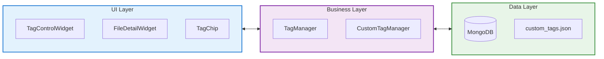
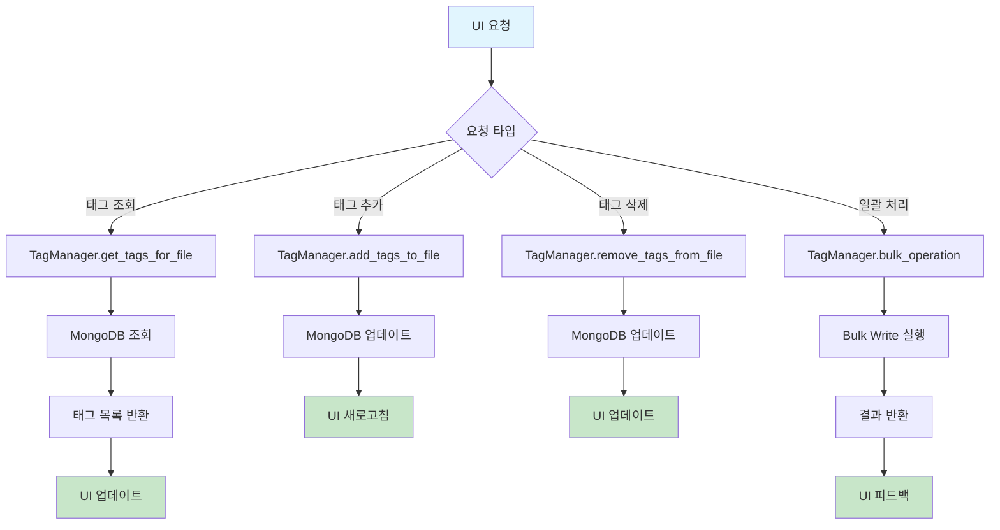
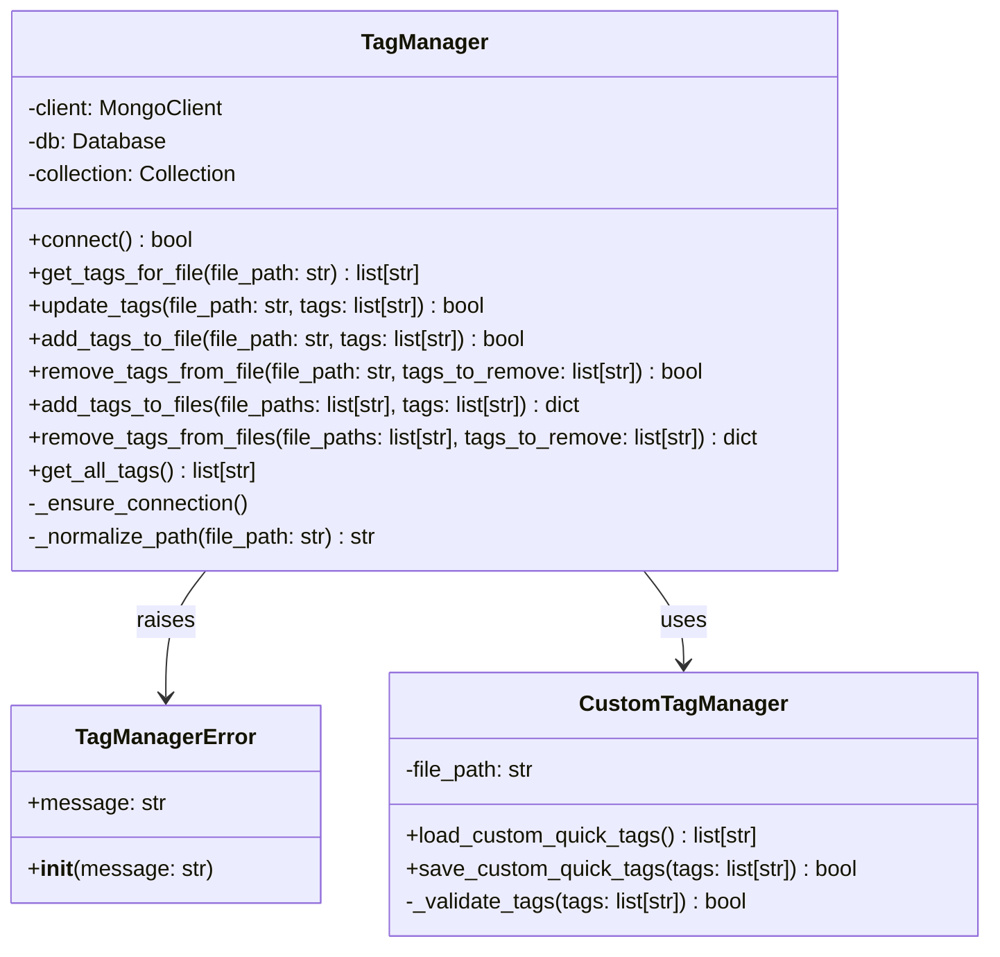

# 기술 스펙 정의서 (Technical Specification)

*   **문서 ID**: `TS-20250711-001`
*   **작성일**: `2025년 7월 11일`
*   **작성자**: `Gemini`
*   **기능명**: `태그 관리 시스템`
*   **버전**: `1.0`

---

### 1. 개요 (Overview)

태그 관리 시스템은 FileTagger 애플리케이션의 핵심 기능으로, 파일과 디렉토리에 메타데이터 형태의 태그를 저장, 조회, 수정, 삭제하는 기능을 제공합니다. MongoDB를 기반으로 한 NoSQL 데이터베이스를 사용하여 파일 경로와 태그 정보를 효율적으로 관리하며, PyQt5 기반의 UI 컴포넌트들과 연동하여 사용자 친화적인 태그 관리 인터페이스를 제공합니다.

**핵심 기술 요구사항:**
- MongoDB 기반 태그 데이터 영속성
- 파일 경로 정규화 및 중복 방지
- 일괄 태그 처리 성능 최적화
- 실시간 UI 업데이트
- 에러 처리 및 복구 메커니즘

### 2. 시스템 아키텍처 (System Architecture)

#### 2.1. 전체 구조



#### 2.2. 컴포넌트 관계

- **UI Layer**: 사용자 인터페이스 컴포넌트들
  - `TagControlWidget`: 태그 입력 및 관리 UI
  - `FileDetailWidget`: 파일별 태그 표시
  - `TagChip`: 개별 태그 표시 및 삭제
  - `QuickTagsWidget`: 빠른 태그 선택

- **Business Layer**: 비즈니스 로직 처리
  - `TagManager`: MongoDB 기반 태그 CRUD 작업
  - `CustomTagManager`: 사용자 정의 태그 영속성 관리

- **Data Layer**: 데이터 저장소
  - MongoDB: 파일-태그 매핑 데이터
  - JSON 파일: 사용자 정의 태그 목록

#### 2.3. 데이터 흐름



### 3. 상세 설계 (Detailed Design)

#### 3.1. 클래스 설계



#### 3.2. 데이터 모델

**MongoDB 스키마**
```javascript
// tags 컬렉션
{
  "_id": "normalized_file_path",  // 파일 경로 (정규화됨)
  "tags": ["tag1", "tag2", "tag3"],  // 태그 배열
  "created_at": ISODate("2025-07-11T..."),
  "updated_at": ISODate("2025-07-11T...")
}
```

**JSON 파일 구조 (custom_tags.json)**
```json
[
  "자주사용하는태그1",
  "자주사용하는태그2",
  "자주사용하는태그3"
]
```

#### 3.3. 인터페이스 설계

**시그널-슬롯 연결**
```python
# TagControlWidget 시그널
tags_updated = pyqtSignal()

# FileDetailWidget 시그널
file_tags_changed = pyqtSignal()

# TagChip 시그널
tag_removed = pyqtSignal(str)  # 태그명
```

### 4. 구현 세부사항 (Implementation Details)

#### 4.1. 핵심 알고리즘

**파일 경로 정규화 알고리즘**
```python
def normalize_path(file_path: str) -> str:
    # 1. 절대 경로로 변환
    # 2. 경로 구분자 통일 (Windows: \, Unix: /)
    # 3. 중복 구분자 제거
    # 4. 대소문자 처리 (Windows는 대소문자 무시)
    return normalized_path
```

**일괄 태그 처리 알고리즘**
```python
def bulk_tag_operation(file_paths: list, tags: list, operation: str):
    # 1. 파일 경로 정규화
    normalized_paths = [normalize_path(p) for p in file_paths]
    
    # 2. 기존 태그 조회 (한 번에)
    existing_docs = collection.find({"_id": {"$in": normalized_paths}})
    
    # 3. Bulk Write 작업 준비
    bulk_operations = []
    for file_path in normalized_paths:
        existing_tags = get_existing_tags(file_path)
        new_tags = calculate_new_tags(existing_tags, tags, operation)
        bulk_operations.append(UpdateOne(...))
    
    # 4. 일괄 실행
    result = collection.bulk_write(bulk_operations)
```

#### 4.2. 성능 고려사항

- **인덱싱**: `_id` 필드에 기본 인덱스 사용
- **Bulk Write**: 일괄 태그 처리 시 `bulk_write` 사용으로 성능 최적화
- **연결 풀링**: MongoDB 연결 재사용
- **메모리 관리**: 대용량 파일 목록 처리 시 청크 단위 처리

#### 4.3. 메모리 관리

- **태그 캐싱**: 자주 사용되는 태그 목록 메모리 캐싱
- **연결 관리**: MongoDB 연결 상태 모니터링 및 자동 재연결
- **가비지 컬렉션**: 불필요한 객체 참조 해제

#### 4.4. 동시성 처리

- **단일 스레드**: PyQt5 메인 스레드에서 모든 DB 작업 처리
- **비동기 처리**: 향후 대용량 처리 시 백그라운드 스레드 고려

#### 4.5. 에러 처리

```python
def _ensure_connection(self):
    try:
        if not self.client:
            self.connect()
        # 연결 상태 확인
        self.client.admin.command("ping")
    except Exception as e:
        logger.error(f"Database connection failed: {e}")
        raise TagManagerError(f"Database connection failed: {e}")
```

### 5. 외부 의존성 (External Dependencies)

#### 5.1. 라이브러리

- **pymongo**: MongoDB Python 드라이버 (버전 4.x)
- **PyQt5**: GUI 프레임워크 (버전 5.15.x)
- **logging**: Python 표준 로깅 라이브러리

#### 5.2. 프레임워크

- **PyQt5**: Qt 기반 GUI 프레임워크
- **MongoDB**: NoSQL 데이터베이스

#### 5.3. 데이터베이스

- **MongoDB**: 버전 4.4 이상
- **연결 설정**: localhost:27018
- **데이터베이스**: file_tagger
- **컬렉션**: tags

#### 5.4. 파일 시스템

- **JSON 파일**: UTF-8 인코딩으로 사용자 정의 태그 저장
- **경로 처리**: 크로스 플랫폼 경로 정규화

### 6. 보안 고려사항 (Security Considerations)

#### 6.1. 입력 검증

- **파일 경로 검증**: 경로 순회 공격 방지
- **태그 입력 검증**: 특수 문자 및 길이 제한
- **SQL Injection 방지**: MongoDB 쿼리 파라미터화

#### 6.2. 데이터 보호

- **민감 정보**: 파일 경로만 저장, 파일 내용은 접근하지 않음
- **접근 제어**: 로컬 데이터베이스 사용으로 접근 제한

### 7. 테스트 전략 (Testing Strategy)

#### 7.1. 단위 테스트

- **TagManager 테스트**: 각 CRUD 메서드별 테스트
- **CustomTagManager 테스트**: JSON 파일 읽기/쓰기 테스트
- **경로 정규화 테스트**: 다양한 운영체제 경로 테스트

#### 7.2. 통합 테스트

- **UI-데이터베이스 통합**: 태그 추가/삭제 시나리오
- **일괄 처리 테스트**: 대량 파일 태그 처리

#### 7.3. 성능 테스트

- **대용량 데이터 테스트**: 10,000개 파일 태그 처리
- **동시 접근 테스트**: 다중 사용자 시나리오

### 8. 배포 및 운영 (Deployment & Operations)

#### 8.1. 배포 요구사항

- **MongoDB**: 로컬 또는 원격 MongoDB 서버
- **Python**: 3.8 이상
- **의존성**: requirements.txt 명시된 패키지들

#### 8.2. 모니터링

- **연결 상태**: MongoDB 연결 상태 모니터링
- **성능 지표**: 태그 처리 시간, 메모리 사용량

#### 8.3. 로깅

```python
# 로깅 설정
logging.basicConfig(level=logging.INFO)
logger = logging.getLogger(__name__)

# 주요 로그 포인트
logger.info("Tag operation completed")
logger.error("Database connection failed")
logger.debug("Processing file: %s", file_path)
```

### 9. 위험 요소 및 대응 방안 (Risks & Mitigation)

#### 9.1. 기술적 위험

- **MongoDB 연결 실패**: 자동 재연결 메커니즘 구현
- **메모리 부족**: 대용량 처리 시 청크 단위 처리
- **파일 경로 변경**: 파일 이동 감지 및 태그 마이그레이션

#### 9.2. 성능 위험

- **대용량 데이터**: 인덱싱 및 쿼리 최적화
- **UI 응답성**: 백그라운드 처리 고려

#### 9.3. 보안 위험

- **경로 순회**: 입력 검증 강화
- **데이터 손실**: 정기 백업 및 복구 메커니즘

### 10. 향후 개선 계획 (Future Improvements)

#### 10.1. 확장성

- **분산 처리**: 대용량 데이터 처리 시 분산 아키텍처
- **API 확장**: RESTful API 제공
- **플러그인 시스템**: 사용자 정의 태그 처리 플러그인

#### 10.2. 최적화

- **캐싱**: Redis 기반 캐싱 시스템
- **인덱싱**: 복합 인덱스 및 텍스트 검색 인덱스
- **압축**: 태그 데이터 압축 저장

#### 10.3. 유지보수

- **코드 리팩토링**: 모듈화 및 인터페이스 개선
- **문서화**: API 문서 및 사용자 가이드
- **테스트 커버리지**: 테스트 커버리지 90% 이상 유지

---

### 부록 (Appendix)

#### A. 용어 정의

- **태그**: 파일을 분류하기 위한 메타데이터 문자열
- **정규화**: 파일 경로를 표준 형식으로 변환하는 과정
- **일괄 처리**: 여러 파일에 동시에 태그 작업을 수행하는 기능

#### B. 참고 자료

- MongoDB Python Driver Documentation
- PyQt5 Signal and Slot Documentation
- FileTagger 기능 명세서 (FS-20250711-002)

#### C. 변경 이력

- **v1.0** (2025-07-11): 초기 버전 작성

--- 