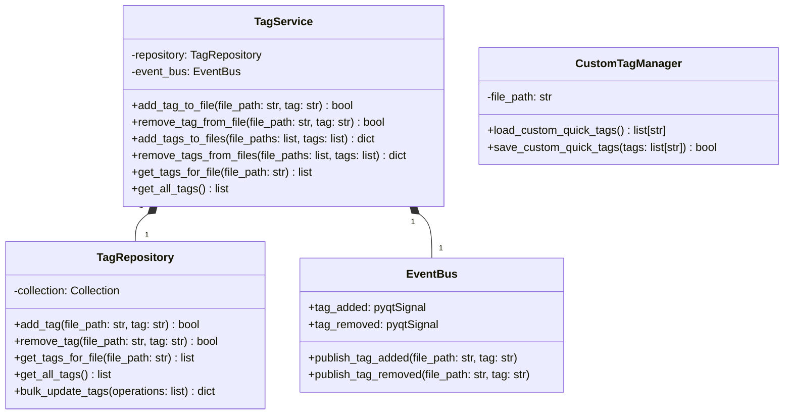

# 기술 스펙 정의서 (Technical Specification)

*   **문서 ID**: `TS-20250711-001`
*   **작성일**: `2025년 7월 11일`
*   **작성자**: `Gemini`
*   **기능명**: `태그 관리 시스템`
*   **버전**: `1.0`

---

### 1. 개요 (Overview)

태그 관리 시스템은 FileTagger 애플리케이션의 핵심 기능으로, 파일과 디렉토리에 메타데이터 형태의 태그를 저장, 조회, 수정, 삭제하는 기능을 제공합니다. MongoDB를 기반으로 한 NoSQL 데이터베이스를 사용하여 파일 경로와 태그 정보를 효율적으로 관리하며, PyQt5 기반의 UI 컴포넌트들과 연동하여 사용자 친화적인 태그 관리 인터페이스를 제공합니다.

**핵심 기술 요구사항:**
- MongoDB 기반 태그 데이터 영속성
- 파일 경로 정규화 및 중복 방지
- 일괄 태그 처리 성능 최적화
- 실시간 UI 업데이트
- 에러 처리 및 복구 메커니즘

### 2. 시스템 아키텍처 (System Architecture)

#### 2.1. 전체 구조

```mermaid
graph LR
    subgraph UILayer["UI Layer"]
        TCW[TagControlWidget]
        FDW[FileDetailWidget]
        TC[TagChip]
    end

    subgraph ViewModelLayer["ViewModel Layer"]
        TCVM[TagControlViewModel]
        FDVM[FileDetailViewModel]
    end
    
    subgraph ServiceLayer["Service Layer"]
        TS[TagService]
        EB[EventBus]
        CTM[CustomTagManager]
    end
    
    subgraph RepositoryLayer["Repository Layer"]
        TR[TagRepository]
    end

    subgraph DataLayer["Data Layer"]
        MDB[(MongoDB)]
        CTJ[custom_tags.json]
    end
    
    UILayer <--> ViewModelLayer
    ViewModelLayer <--> ServiceLayer
    ServiceLayer <--> RepositoryLayer
    RepositoryLayer <--> DataLayer
    
    style UILayer fill:#e3f2fd,stroke:#1976d2,stroke-width:2px
    style ViewModelLayer fill:#e0f7fa,stroke:#00796b,stroke-width:2px
    style ServiceLayer fill:#f3e5f5,stroke:#7b1fa2,stroke-width:2px
    style RepositoryLayer fill:#ede7f6,stroke:#5e35b1,stroke-width:2px
    style DataLayer fill:#e8f5e8,stroke:#388e3c,stroke-width:2px
```



#### 2.2. 컴포넌트 관계

- **UI Layer**: 사용자 인터페이스 컴포넌트. 사용자의 입력을 받고 정보를 표시합니다.
  - `TagControlWidget`, `FileDetailWidget`, `TagChip`, `QuickTagsWidget`
- **ViewModel Layer**: UI의 상태와 동작을 관리합니다. UI와 서비스 계층을 분리합니다.
  - `TagControlViewModel`, `FileDetailViewModel`
- **Service Layer**: 핵심 비즈니스 로직을 처리하고, 여러 리포지토리를 조합하여 기능을 구현합니다.
  - `TagService`: 태그 관련 핵심 로직(CRUD, 일괄 처리)을 담당합니다.
  - `EventBus`: 컴포넌트 간의 느슨한 결합을 위한 이벤트 발행/구독 시스템입니다.
  - `CustomTagManager`: `custom_tags.json` 파일에 대한 읽기/쓰기 로직을 담당합니다.
- **Repository Layer**: 데이터베이스와의 상호작용을 추상화합니다.
  - `TagRepository`: MongoDB `tagged_files` 컬렉션에 대한 CRUD 작업을 직접 수행합니다.
- **Data Layer**: 실제 데이터가 저장되는 곳입니다.
  - `MongoDB`: 파일-태그 매핑 데이터를 저장합니다.
  - `custom_tags.json`: 사용자 정의 빠른 태그 목록을 저장합니다.

#### 2.3. 데이터 흐름

```mermaid
flowchart TD
    A[UI 요청 (e.g., 태그 추가 클릭)] --> B[ViewModel]
    B --> C[TagService.add_tag_to_file]
    C --> D[TagRepository.add_tag]
    D --> E[MongoDB 업데이트]
    E --> F{성공/실패}
    F -->|성공| G[TagService]
    G --> H[EventBus.publish_tag_added]
    H --> I[모든 구독자 (ViewModel)에게 전파]
    I --> J[ViewModel이 UI 업데이트 시그널 발생]
    J --> K[UI 업데이트]
    
    style A fill:#e1f5fe
    style K fill:#c8e6c9
```

### 3. 상세 설계 (Detailed Design)

#### 3.1. 클래스 설계



#### 3.2. 데이터 모델

**MongoDB 스키마 (tagged_files 컬렉션)**
```javascript
// 실제 구현에서는 MongoDB가 자동 생성하는 _id를 사용합니다.
{
  "_id": ObjectId("..."),
  "file_path": "C:\path\to\normalized\file.txt", // 정규화된 파일 경로 (인덱싱 필요)
  "tags": ["tag1", "tag2", "tag3"] // 태그 배열
}
```
*   **`file_path`**: `core.path_utils.normalize_path` 함수를 통해 정규화된 파일의 전체 경로입니다. 이 필드에 고유 인덱스(unique index)를 생성하여 중복 입력을 방지하고 조회 성능을 향상시킵니다.
*   **`tags`**: 해당 파일에 연결된 태그 문자열의 배열입니다.

**JSON 파일 구조 (custom_tags.json)**
```json
[
  "자주사용하는태그1",
  "자주사용하는태그2",
  "자주사용하는태그3"
]
```

#### 3.3. 인터페이스 설계

**ViewModel 시그널**
```python
# TagControlViewModel 시그널
tags_updated = pyqtSignal(list)
target_info_updated = pyqtSignal(str, bool)
show_message = pyqtSignal(str, int)

# FileDetailViewModel 시그널
file_details_updated = pyqtSignal(str, list)
```

**EventBus 이벤트**
```python
# EventBus에서 발행하는 이벤트 (데이터 클래스 활용)
@dataclass
class TagAddedEvent:
    file_path: str
    tag: str

@dataclass  
class TagRemovedEvent:
    file_path: str
    tag: str
```

### 4. 구현 세부사항 (Implementation Details)

#### 4.1. 핵심 알고리즘

**파일 경로 정규화 (`core/path_utils.py`)**
```python
def normalize_path(path: str) -> str:
    # os.path.normpath를 사용하여 운영체제에 맞는 경로 구분자로 정규화
    normalized = os.path.normpath(path)
    # Windows 환경을 가정하고 모든 슬래시를 역슬래시로 변환
    if os.sep == '\\':
        normalized = normalized.replace('/', '\\')
    return normalized
```

**일괄 태그 처리 (`TagService` 및 `TagRepository`)**
```python
# TagService
def add_tags_to_files(self, file_paths: list, tags_to_add: list) -> dict:
    bulk_operations = []
    for file_path in file_paths:
        # ... 기존 태그와 새 태그를 병합하는 로직 ...
        bulk_operations.append(
            UpdateOne({"file_path": normalized_path}, {"$set": {"tags": new_tags}}, upsert=True)
        )
    return self._repository.bulk_update_tags(bulk_operations)

# TagRepository
def bulk_update_tags(self, operations: list) -> dict:
    if not operations:
        return {"modified": 0, "upserted": 0}
    result = self._collection.bulk_write(operations)
    return {"modified": result.modified_count, "upserted": result.upserted_count}
```

#### 4.2. 성능 고려사항

- **인덱싱**: `file_path` 필드에 고유 인덱스를 생성하여 조회 및 업데이트 성능을 최적화합니다.
- **Bulk Write**: 일괄 태그 추가/삭제 시 `bulk_write`를 사용하여 MongoDB와의 통신 횟수를 최소화합니다.
- **연결 관리**: `pymongo` 드라이버의 내장 커넥션 풀링을 활용합니다.

#### 4.3. 메모리 관리

- **데이터 로딩**: 대용량 데이터 조회 시 필요한 만큼만 DB에서 가져오도록 쿼리를 최적화합니다. (현재는 모든 태그를 가져오는 방식 위주)
- **가비지 컬렉션**: Python의 자동 가비지 컬렉션에 의존합니다.

#### 4.4. 동시성 처리

- **단일 스레드**: 현재 모든 DB 작업은 PyQt5의 메인 UI 스레드에서 동기적으로 처리됩니다.
- **향후 개선**: 대용량 파일 처리나 네트워크 지연이 발생할 수 있는 작업을 위해 `QThread`를 사용한 비동기 처리 도입을 고려해야 합니다.

#### 4.5. 에러 처리

- 현재 구현은 `try-except` 블록을 사용하여 예외를 잡고 `logging`을 통해 오류를 기록하는 방식을 사용합니다.
- 사용자에게 피드백이 필요한 경우(예: DB 연결 실패), ViewModel의 `show_message` 시그널을 통해 상태 표시줄이나 다이얼로그에 메시지를 표시할 수 있습니다.
- 명시적인 커스텀 예외 클래스(`TagManagerError`)는 사용하지 않습니다.
```python
# 예시: TagService
def add_tag_to_file(self, file_path: str, tag: str) -> bool:
    try:
        result = self._repository.add_tag(file_path, tag)
        if result:
            self._event_bus.publish_tag_added(file_path, tag)
        return result
    except Exception as e:
        logger.error(f"Error adding tag to {file_path}: {e}")
        return False
```

### 5. 외부 의존성 (External Dependencies)

#### 5.1. 라이브러리

- **pymongo**: MongoDB Python 드라이버 (버전 4.x)
- **PyQt5**: GUI 프레임워크 (버전 5.15.x)
- **logging**: Python 표준 로깅 라이브러리

#### 5.2. 프레임워크

- **PyQt5**: Qt 기반 GUI 프레임워크
- **MongoDB**: NoSQL 데이터베이스

#### 5.3. 데이터베이스

- **MongoDB**: 버전 4.4 이상
- **연결 설정**: localhost:27018
- **데이터베이스**: file_tagger
- **컬렉션**: tags

#### 5.4. 파일 시스템

- **JSON 파일**: UTF-8 인코딩으로 사용자 정의 태그 저장
- **경로 처리**: 크로스 플랫폼 경로 정규화

### 6. 보안 고려사항 (Security Considerations)

#### 6.1. 입력 검증

- **파일 경로 검증**: 경로 순회 공격 방지
- **태그 입력 검증**: 특수 문자 및 길이 제한
- **SQL Injection 방지**: MongoDB 쿼리 파라미터화

#### 6.2. 데이터 보호

- **민감 정보**: 파일 경로만 저장, 파일 내용은 접근하지 않음
- **접근 제어**: 로컬 데이터베이스 사용으로 접근 제한

### 7. 테스트 전략 (Testing Strategy)

#### 7.1. 단위 테스트

- **TagManager 테스트**: 각 CRUD 메서드별 테스트
- **CustomTagManager 테스트**: JSON 파일 읽기/쓰기 테스트
- **경로 정규화 테스트**: 다양한 운영체제 경로 테스트

#### 7.2. 통합 테스트

- **UI-데이터베이스 통합**: 태그 추가/삭제 시나리오
- **일괄 처리 테스트**: 대량 파일 태그 처리

#### 7.3. 성능 테스트

- **대용량 데이터 테스트**: 10,000개 파일 태그 처리
- **동시 접근 테스트**: 다중 사용자 시나리오

### 8. 배포 및 운영 (Deployment & Operations)

#### 8.1. 배포 요구사항

- **MongoDB**: 로컬 또는 원격 MongoDB 서버
- **Python**: 3.8 이상
- **의존성**: requirements.txt 명시된 패키지들

#### 8.2. 모니터링

- **연결 상태**: MongoDB 연결 상태 모니터링
- **성능 지표**: 태그 처리 시간, 메모리 사용량

#### 8.3. 로깅

```python
# 로깅 설정
logging.basicConfig(level=logging.INFO)
logger = logging.getLogger(__name__)

# 주요 로그 포인트
logger.info("Tag operation completed")
logger.error("Database connection failed")
logger.debug("Processing file: %s", file_path)
```

### 9. 위험 요소 및 대응 방안 (Risks & Mitigation)

#### 9.1. 기술적 위험

- **MongoDB 연결 실패**: 자동 재연결 메커니즘 구현
- **메모리 부족**: 대용량 처리 시 청크 단위 처리
- **파일 경로 변경**: 파일 이동 감지 및 태그 마이그레이션

#### 9.2. 성능 위험

- **대용량 데이터**: 인덱싱 및 쿼리 최적화
- **UI 응답성**: 백그라운드 처리 고려

#### 9.3. 보안 위험

- **경로 순회**: 입력 검증 강화
- **데이터 손실**: 정기 백업 및 복구 메커니즘

### 10. 향후 개선 계획 (Future Improvements)

#### 10.1. 확장성

- **분산 처리**: 대용량 데이터 처리 시 분산 아키텍처
- **API 확장**: RESTful API 제공
- **플러그인 시스템**: 사용자 정의 태그 처리 플러그인

#### 10.2. 최적화

- **캐싱**: Redis 기반 캐싱 시스템
- **인덱싱**: 복합 인덱스 및 텍스트 검색 인덱스
- **압축**: 태그 데이터 압축 저장

#### 10.3. 유지보수

- **코드 리팩토링**: 모듈화 및 인터페이스 개선
- **문서화**: API 문서 및 사용자 가이드
- **테스트 커버리지**: 테스트 커버리지 90% 이상 유지

---

### 부록 (Appendix)

#### A. 용어 정의

- **태그**: 파일을 분류하기 위한 메타데이터 문자열
- **정규화**: 파일 경로를 표준 형식으로 변환하는 과정
- **일괄 처리**: 여러 파일에 동시에 태그 작업을 수행하는 기능

#### B. 참고 자료

- MongoDB Python Driver Documentation
- PyQt5 Signal and Slot Documentation
- FileTagger 기능 명세서 (FS-20250711-002)

#### C. 변경 이력

- **v1.0** (2025-07-11): 초기 버전 작성

--- 