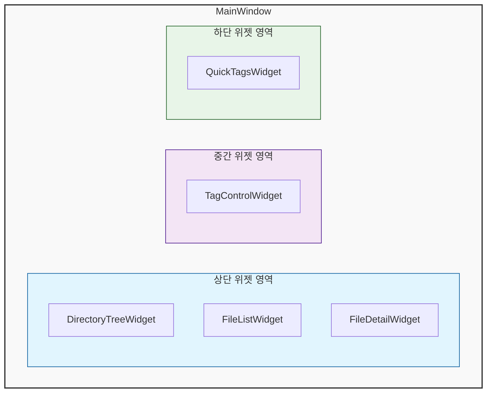
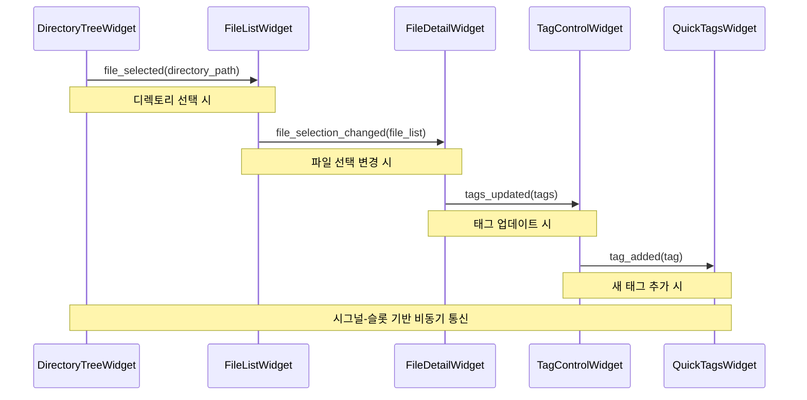
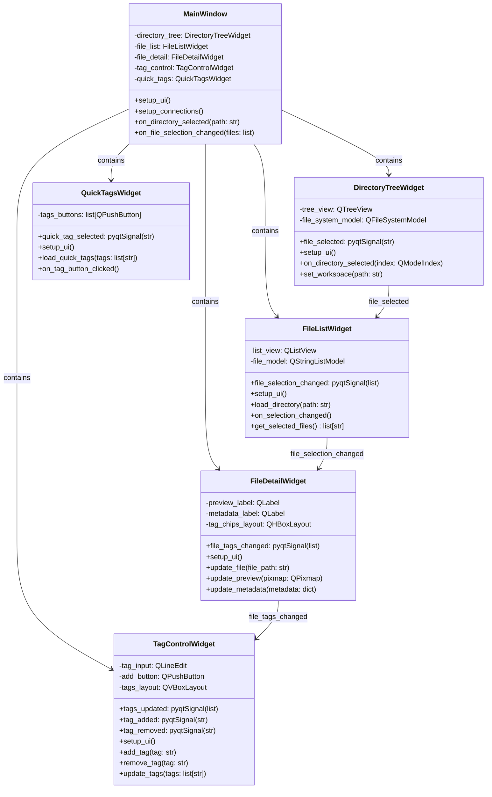

# 기술 스펙 정의서 (Technical Specification)

*   **문서 ID**: `TS-20250711-002`
*   **작성일**: `2025년 7월 11일`
*   **작성자**: `Gemini`
*   **기능명**: `UI 컴포넌트 시스템`
*   **버전**: `1.0`

---

### 1. 개요 (Overview)

UI 컴포넌트 시스템은 FileTagger 애플리케이션의 사용자 인터페이스를 구성하는 핵심 모듈로, PyQt5 프레임워크를 기반으로 한 재사용 가능한 위젯 컴포넌트들을 제공합니다. 각 컴포넌트는 독립적인 기능을 수행하면서도 시그널-슬롯 메커니즘을 통해 상호 통신하며, 모듈화된 설계로 유지보수성과 확장성을 보장합니다.

**핵심 기술 요구사항:**
- PyQt5 기반 위젯 컴포넌트 시스템
- 시그널-슬롯 기반 컴포넌트 간 통신
- Qt Designer UI 파일과 Python 코드 분리
- 반응형 레이아웃 및 사용자 경험 최적화
- 테마 및 스타일링 시스템

### 2. 시스템 아키텍처 (System Architecture)

#### 2.1. 전체 구조



#### 2.2. 컴포넌트 계층 구조

- **Level 1**: MainWindow (메인 애플리케이션 윈도우)
- **Level 2**: 주요 위젯 컴포넌트들
  - DirectoryTreeWidget (디렉토리 트리)
  - FileListWidget (파일 목록)
  - FileDetailWidget (파일 상세 정보)
  - TagControlWidget (태그 제어)
  - QuickTagsWidget (빠른 태그)
- **Level 3**: 서브 컴포넌트들
  - TagChip (개별 태그 표시)
  - CustomTagDialog (사용자 정의 태그 다이얼로그)
  - BatchRemoveTagsDialog (일괄 태그 제거 다이얼로그)

#### 2.3. 컴포넌트 간 통신



### 3. 상세 설계 (Detailed Design)

#### 3.1. 클래스 설계



#### 3.2. 데이터 모델

**파일 시스템 모델**
```python
class FileSystemModel(QFileSystemModel):
    def __init__(self):
        super().__init__()
        self.setFilter(QDir.AllEntries | QDir.NoDotAndDotDot)
        self.setNameFilters(["*.jpg", "*.png", "*.pdf", "*.txt", "*.mp4"])
```

**태그 데이터 모델**
```python
class TagModel(QStringListModel):
    def __init__(self, tags=None):
        super().__init__()
        if tags:
            self.setStringList(tags)
    
    def add_tag(self, tag):
        current_tags = self.stringList()
        if tag not in current_tags:
            current_tags.append(tag)
            self.setStringList(current_tags)
```

#### 3.3. 인터페이스 설계

**시그널 정의**
```python
# DirectoryTreeWidget 시그널
file_selected = pyqtSignal(str)  # 디렉토리 경로

# FileListWidget 시그널
file_selection_changed = pyqtSignal(list)  # 파일 경로 목록
directory_changed = pyqtSignal(str)  # 디렉토리 경로

# FileDetailWidget 시그널
file_tags_changed = pyqtSignal(list)  # 태그 목록
file_metadata_updated = pyqtSignal(dict)  # 메타데이터

# TagControlWidget 시그널
tags_updated = pyqtSignal(list)  # 업데이트된 태그 목록
tag_added = pyqtSignal(str)  # 추가된 태그
tag_removed = pyqtSignal(str)  # 제거된 태그

# QuickTagsWidget 시그널
quick_tag_selected = pyqtSignal(str)  # 선택된 빠른 태그
```

### 4. 구현 세부사항 (Implementation Details)

#### 4.1. 핵심 알고리즘

**파일 필터링 알고리즘**
```python
def filter_files(directory_path: str, file_types: list) -> list[str]:
    filtered_files = []
    for root, dirs, files in os.walk(directory_path):
        for file in files:
            if any(file.lower().endswith(ext) for ext in file_types):
                full_path = os.path.join(root, file)
                filtered_files.append(full_path)
    return filtered_files
```

**태그 자동완성 알고리즘**
```python
def get_tag_suggestions(input_text: str, existing_tags: list) -> list[str]:
    suggestions = []
    input_lower = input_text.lower()
    for tag in existing_tags:
        if input_lower in tag.lower():
            suggestions.append(tag)
    return suggestions[:5]  # 최대 5개 제안
```

**파일 미리보기 생성 알고리즘**
```python
def generate_preview(file_path: str, max_size: tuple = (300, 300)) -> QPixmap:
    file_ext = os.path.splitext(file_path)[1].lower()
    
    if file_ext in ['.jpg', '.png', '.gif', '.bmp']:
        return create_image_preview(file_path, max_size)
    elif file_ext == '.pdf':
        return create_pdf_preview(file_path, max_size)
    elif file_ext in ['.mp4', '.avi', '.mov']:
        return create_video_preview(file_path, max_size)
    else:
        return create_text_preview(file_path, max_size)
```

#### 4.2. 성능 고려사항

- **지연 로딩**: 대용량 디렉토리에서 파일 목록 지연 로딩
- **캐싱**: 파일 미리보기 및 메타데이터 캐싱
- **가상화**: 대량 파일 목록에서 QListView 가상화 사용
- **백그라운드 처리**: 파일 스캔 및 미리보기 생성 백그라운드 스레드

#### 4.3. 메모리 관리

- **미리보기 캐시**: LRU 캐시를 사용한 미리보기 이미지 관리
- **모델 데이터**: 대용량 데이터 처리 시 청크 단위 로딩
- **위젯 정리**: 위젯 소멸 시 리소스 해제

#### 4.4. 동시성 처리

```python
class PreviewWorker(QThread):
    preview_ready = pyqtSignal(str, QPixmap)  # 파일 경로, 미리보기
    
    def __init__(self, file_path):
        super().__init__()
        self.file_path = file_path
    
    def run(self):
        preview = generate_preview(self.file_path)
        self.preview_ready.emit(self.file_path, preview)
```

#### 4.5. 에러 처리

```python
def safe_file_operation(func):
    def wrapper(*args, **kwargs):
        try:
            return func(*args, **kwargs)
        except PermissionError:
            QMessageBox.warning(None, "권한 오류", "파일에 접근할 권한이 없습니다.")
        except FileNotFoundError:
            QMessageBox.warning(None, "파일 없음", "파일을 찾을 수 없습니다.")
        except Exception as e:
            QMessageBox.critical(None, "오류", f"예상치 못한 오류가 발생했습니다: {str(e)}")
    return wrapper
```

### 5. 외부 의존성 (External Dependencies)

#### 5.1. 라이브러리

- **PyQt5**: GUI 프레임워크 (버전 5.15.x)
- **Pillow**: 이미지 처리 (버전 9.x)
- **PyMuPDF**: PDF 처리 (버전 1.21.x)
- **opencv-python**: 비디오 처리 (버전 4.7.x)

#### 5.2. 프레임워크

- **PyQt5**: Qt 기반 GUI 프레임워크
- **Qt Designer**: UI 디자인 도구

#### 5.3. 파일 시스템

- **지원 파일 형식**:
  - 이미지: JPG, PNG, GIF, BMP
  - 문서: PDF, TXT
  - 비디오: MP4, AVI, MOV
- **파일 크기 제한**: 미리보기 생성 시 50MB 이하

### 6. 보안 고려사항 (Security Considerations)

#### 6.1. 입력 검증

- **파일 경로 검증**: 경로 순회 공격 방지
- **파일 형식 검증**: 허용된 파일 형식만 처리
- **파일 크기 제한**: 대용량 파일 처리 제한

#### 6.2. 데이터 보호

- **임시 파일**: 미리보기 생성 시 임시 파일 안전한 처리
- **메모리 보호**: 민감한 파일 데이터 메모리에서 안전한 제거

### 7. 테스트 전략 (Testing Strategy)

#### 7.1. 단위 테스트

- **위젯 테스트**: 각 위젯 컴포넌트별 독립 테스트
- **시그널 테스트**: 시그널-슬롯 연결 테스트
- **모델 테스트**: 데이터 모델 동작 테스트

#### 7.2. 통합 테스트

- **컴포넌트 통합**: 위젯 간 상호작용 테스트
- **UI 플로우**: 사용자 시나리오 기반 테스트

#### 7.3. 성능 테스트

- **대용량 데이터**: 10,000개 파일 처리 테스트
- **메모리 사용량**: 장시간 사용 시 메모리 누수 테스트

### 8. 배포 및 운영 (Deployment & Operations)

#### 8.1. 배포 요구사항

- **Python**: 3.8 이상
- **PyQt5**: 5.15.x 이상
- **운영체제**: Windows 10+, macOS 10.14+, Ubuntu 18.04+

#### 8.2. 모니터링

- **UI 응답성**: 사용자 인터페이스 응답 시간 모니터링
- **메모리 사용량**: 위젯별 메모리 사용량 추적

#### 8.3. 로깅

```python
import logging

logger = logging.getLogger(__name__)

def log_ui_event(event_type: str, details: dict):
    logger.info(f"UI Event: {event_type} - {details}")
```

### 9. 위험 요소 및 대응 방안 (Risks & Mitigation)

#### 9.1. 기술적 위험

- **메모리 누수**: 위젯 소멸 시 리소스 정리 강화
- **UI 응답성 저하**: 백그라운드 처리 및 진행률 표시
- **파일 시스템 접근 실패**: 에러 처리 및 사용자 피드백

#### 9.2. 성능 위험

- **대용량 파일 처리**: 청크 단위 처리 및 진행률 표시
- **UI 블로킹**: 백그라운드 스레드 사용

#### 9.3. 사용자 경험 위험

- **복잡한 인터페이스**: 직관적인 UI 설계 및 도움말 제공
- **느린 응답**: 로딩 인디케이터 및 캐싱 시스템

### 10. 향후 개선 계획 (Future Improvements)

#### 10.1. 확장성

- **플러그인 시스템**: 사용자 정의 위젯 플러그인
- **테마 시스템**: 다크 모드 및 커스텀 테마 지원
- **다국어 지원**: 국제화(i18n) 시스템

#### 10.2. 최적화

- **렌더링 최적화**: OpenGL 가속 및 하드웨어 가속
- **메모리 최적화**: 더 효율적인 캐싱 시스템
- **로딩 최적화**: 지연 로딩 및 프리로딩

#### 10.3. 유지보수

- **코드 리팩토링**: 컴포넌트 재사용성 향상
- **문서화**: API 문서 및 개발자 가이드
- **테스트 자동화**: CI/CD 파이프라인 구축

---

### 부록 (Appendix)

#### A. 용어 정의

- **위젯**: PyQt5의 기본 UI 컴포넌트
- **시그널**: Qt의 이벤트 발생 메커니즘
- **슬롯**: 시그널을 받아 처리하는 메서드
- **모델**: 데이터를 관리하는 클래스

#### B. 참고 자료

- PyQt5 Documentation
- Qt Designer User Guide
- FileTagger UI 가이드라인

#### C. 변경 이력

- **v1.0** (2025-07-11): 초기 버전 작성

---

### [2025-07-12] UI 컴포넌트 및 태그 관리 시스템 변경점
- TagControlWidget: 태그 저장 버튼 제거, 태그 입력/추가/삭제 즉시 저장 및 시그널 구조 설명 보강
- FileDetailWidget: '모든 태그 삭제' 버튼 제거, 태그칩(x) 및 일괄삭제 다이얼로그만 사용
- 태그 변경 시 TagControlWidget <-> FileDetailWidget 양방향 시그널 구조로 UI/데이터 동기화