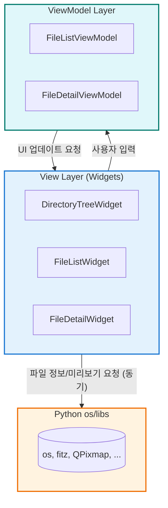
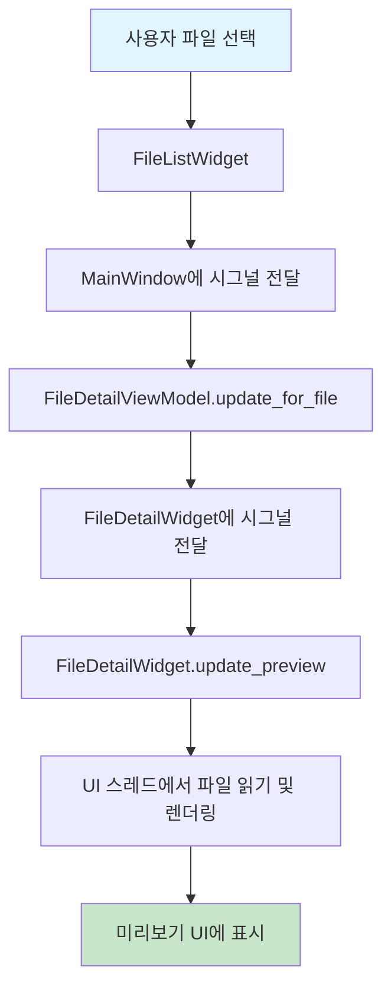

# 기술 스펙 정의서 (Technical Specification)

*   **문서 ID**: `TS-20250711-003`
*   **작성일**: `2025년 7월 11일`
*   **최종 수정일**: `2025년 7월 15일`
*   **작성자**: `Gemini`
*   **기능명**: `파일 시스템 및 미리보기 시스템`
*   **버전**: `1.1`

---

### 1. 개요 (Overview)

파일 시스템 및 미리보기 시스템은 FileTagger 애플리케이션에서 파일 탐색, 필터링, 메타데이터 추출 및 다양한 파일 형식의 미리보기 생성을 담당하는 모듈입니다. 현재 구현은 PyQt5의 UI 스레드에서 동기적으로 파일 시스템에 접근하고 미리보기를 생성합니다.

**핵심 기능 (현재 구현 기준):**
- 크로스 플랫폼 파일 시스템 접근 (`os` 모듈 기반)
- 다양한 파일 형식 지원 (이미지, 문서, 비디오, 텍스트)
- UI 스레드에서의 동기적 미리보기 생성
- 파일 메타데이터 추출 및 표시

**향후 개선 목표:**
- 비동기 파일 스캔 및 미리보기 생성을 통한 UI 응답성 개선
- 메모리 효율적인 캐싱 시스템 도입

### 2. 시스템 아키텍처 (System Architecture)

#### 2.1. 현재 구조

현재 파일 시스템 접근 및 미리보기 생성 로직은 대부분 `FileDetailWidget`과 `DirectoryTreeWidget` 내에 직접 구현되어 있습니다. 별도의 `FileScanner`나 `PreviewGenerator` 클래스로 분리되어 있지 않습니다.



#### 2.2. 데이터 흐름 (현재)



### 3. 상세 설계 (Detailed Design)

#### 3.1. 클래스 설계 (현재)

- **`FileDetailWidget`**: 미리보기 생성의 핵심 로직을 대부분 포함합니다.
  - `update_preview(file_path)`: 파일 확장자를 확인하고, 각 형식에 맞는 렌더링 메서드를 호출합니다.
  - `_render_pdf_thumbnail(file_path)`: `fitz` 라이브러리를 사용해 PDF 썸네일을 생성합니다.
  - 이미지, 텍스트, 비디오(`QMediaPlayer`) 관련 로직이 메서드 내에 직접 구현되어 있습니다.
- **`DirectoryTreeWidget`**: `QFileSystemModel`을 사용하여 디렉토리 구조를 표시합니다.
- **`FileListWidget`**: `FileTableModel`을 통해 파일 목록을 표시합니다.

*별도의 `FileScanner`, `PreviewGenerator`, `PreviewCache` 클래스는 현재 존재하지 않습니다.*

#### 3.2. 데이터 모델

- `FileInfo`나 `Metadata`와 같은 별도의 데이터 클래스는 정의되어 있지 않습니다. 파일 정보는 `os` 모듈을 통해 직접 조회하여 사용합니다.

### 4. 구현 세부사항 (Implementation Details)

#### 4.1. 미리보기 생성 알고리즘 (`FileDetailWidget` 내)

- **이미지**: `QPixmap(file_path)`를 사용하여 직접 로드합니다.
- **PDF**: `fitz.open(file_path)`로 문서를 열고, `page.get_pixmap()`으로 첫 페이지의 이미지를 생성하여 `QLabel`에 표시합니다.
- **비디오**: `QMediaPlayer`를 사용하여 `QVideoWidget`에서 직접 재생합니다. 썸네일을 생성하지 않습니다.
- **텍스트**: 파일을 직접 읽어 `QTextBrowser`에 내용을 표시합니다.

#### 4.2. 성능 고려사항 (현재 상태)

- **동기 처리**: 모든 파일 I/O 및 렌더링 작업이 UI 스레드에서 발생하므로, 대용량 파일이나 많은 파일이 있는 디렉토리 선택 시 UI가 일시적으로 멈출 수 있습니다. **(개선 필요)**
- **캐싱 없음**: 미리보기나 메타데이터에 대한 캐시가 없어, 같은 파일을 다시 선택할 때마다 파일 읽기와 렌더링을 반복합니다. **(개선 필요)**

---
(이하 내용은 향후 개선 계획으로 이동)
---

### 10. 향후 개선 계획 (Future Improvements)

현재 시스템의 성능과 반응성을 개선하기 위해 다음 사항들을 최우선으로 도입해야 합니다.

#### 10.1. 비동기 처리 도입 (`QThread` 활용)

- **`FileScannerWorker`**: 디렉토리 스캔을 백그라운드 스레드에서 수행하여 파일 목록을 비동기적으로 가져옵니다. 진행 상황을 UI에 표시하여 사용자 경험을 개선합니다.
- **`PreviewWorker`**: 파일 미리보기 생성을 백그라운드 스레드에서 처리하여 UI 멈춤 현상을 방지합니다. 생성된 미리보기는 시그널을 통해 UI 스레드로 전달하여 안전하게 업데이트합니다.

```python
# 예시: PreviewWorker
class PreviewWorker(QThread):
    preview_ready = pyqtSignal(str, QPixmap)  # file_path, preview_pixmap

    def run(self):
        # ... 백그라운드에서 미리보기 생성 로직 ...
        self.preview_ready.emit(file_path, pixmap)
```

#### 10.2. 캐싱 시스템 구현

- **`PreviewCache`**: 생성된 미리보기(`QPixmap`)를 메모리에 캐싱합니다. LRU(Least Recently Used) 정책을 사용하여 메모리 사용량을 제한합니다.
- **`MetadataCache`**: 파일 메타데이터(크기, 수정일 등)를 캐싱하여 반복적인 `os.stat` 호출을 줄입니다.

```python
# 예시: LRU 캐시
from collections import OrderedDict

class LRUCache:
    def __init__(self, capacity: int):
        self.cache = OrderedDict()
        self.capacity = capacity

    def get(self, key):
        # ... LRU 로직 ...

    def put(self, key, value):
        # ... LRU 로직 ...
```

#### 10.3. 로직 분리 리팩토링

- **`FileScanner` 클래스**: 파일 시스템 스캔 및 필터링 관련 로직을 별도 클래스로 분리합니다.
- **`PreviewGenerator` 클래스**: 파일 형식별 미리보기 생성 로직을 별도 클래스로 분리하여 `FileDetailWidget`의 복잡도를 낮추고 재사용성을 높입니다.

---

### 부록 (Appendix)

#### C. 변경 이력

- **v1.1** (2025-07-15): 현재 코드베이스(동기 처리)를 반영하고 비동기/캐싱을 향후 개선 과제로 명시.
- **v1.0** (2025-07-11): 초기 버전 작성.