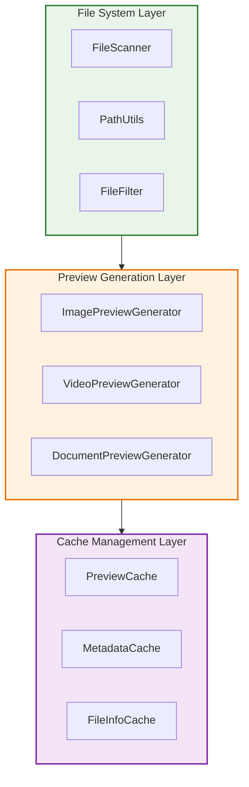
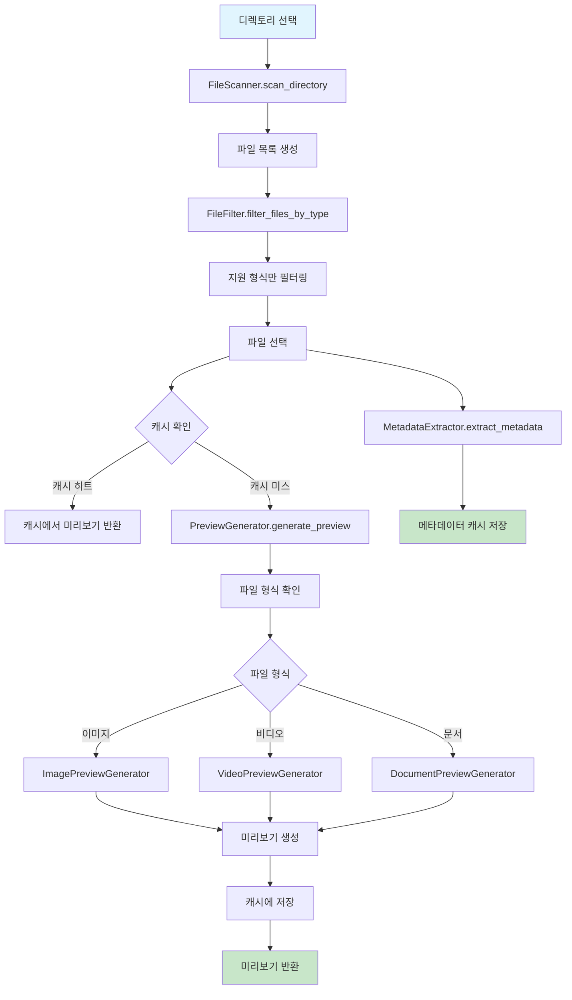
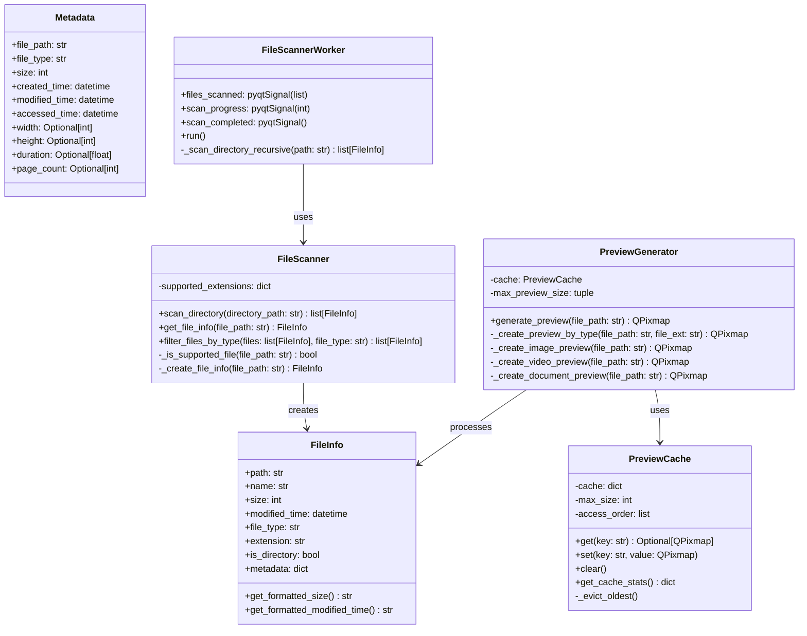

# 기술 스펙 정의서 (Technical Specification)

*   **문서 ID**: `TS-20250711-003`
*   **작성일**: `2025년 7월 11일`
*   **작성자**: `Gemini`
*   **기능명**: `파일 시스템 및 미리보기 시스템`
*   **버전**: `1.0`

---

### 1. 개요 (Overview)

파일 시스템 및 미리보기 시스템은 FileTagger 애플리케이션에서 파일 탐색, 필터링, 메타데이터 추출 및 다양한 파일 형식의 미리보기 생성을 담당하는 핵심 모듈입니다. 크로스 플랫폼 파일 시스템 접근, 비동기 파일 처리, 메모리 효율적인 미리보기 생성 및 캐싱 시스템을 제공하여 사용자에게 빠르고 반응성 있는 파일 탐색 경험을 제공합니다.

**핵심 기술 요구사항:**
- 크로스 플랫폼 파일 시스템 접근
- 다양한 파일 형식 지원 (이미지, 문서, 비디오, 텍스트)
- 비동기 파일 스캔 및 미리보기 생성
- 메모리 효율적인 캐싱 시스템
- 파일 메타데이터 추출 및 표시

### 2. 시스템 아키텍처 (System Architecture)

#### 2.1. 전체 구조



#### 2.2. 컴포넌트 관계

- **File System Layer**: 파일 시스템 접근 및 관리
  - `FileScanner`: 디렉토리 스캔 및 파일 목록 생성
  - `PathUtils`: 경로 정규화 및 유틸리티 함수
  - `FileFilter`: 파일 형식 필터링

- **Preview Generation Layer**: 미리보기 생성
  - `ImagePreviewGenerator`: 이미지 파일 미리보기
  - `VideoPreviewGenerator`: 비디오 파일 미리보기
  - `DocumentPreviewGenerator`: 문서 파일 미리보기

- **Cache Management Layer**: 캐싱 및 성능 최적화
  - `PreviewCache`: 미리보기 이미지 캐싱
  - `MetadataCache`: 파일 메타데이터 캐싱
  - `FileInfoCache`: 파일 정보 캐싱

#### 2.3. 데이터 흐름



### 3. 상세 설계 (Detailed Design)

#### 3.1. 클래스 설계



#### 3.2. 데이터 모델

**FileInfo 클래스**
```python
@dataclass
class FileInfo:
    path: str
    name: str
    size: int
    modified_time: datetime
    file_type: str
    extension: str
    is_directory: bool
    metadata: dict = field(default_factory=dict)
    
    def get_formatted_size(self) -> str:
        """파일 크기를 사람이 읽기 쉬운 형태로 변환"""
        pass
    
    def get_formatted_modified_time(self) -> str:
        """수정 시간을 사람이 읽기 쉬운 형태로 변환"""
        pass
```

**Metadata 클래스**
```python
@dataclass
class Metadata:
    file_path: str
    file_type: str
    size: int
    created_time: datetime
    modified_time: datetime
    accessed_time: datetime
    
    # 이미지 메타데이터
    width: Optional[int] = None
    height: Optional[int] = None
    color_depth: Optional[int] = None
    
    # 비디오 메타데이터
    duration: Optional[float] = None
    fps: Optional[float] = None
    codec: Optional[str] = None
    
    # 문서 메타데이터
    page_count: Optional[int] = None
    author: Optional[str] = None
    title: Optional[str] = None
```

#### 3.3. 인터페이스 설계

**파일 시스템 인터페이스**
```python
class IFileSystem:
    def scan_directory(self, path: str) -> list[FileInfo]:
        """디렉토리 스캔"""
        pass
    
    def get_file_info(self, path: str) -> FileInfo:
        """파일 정보 조회"""
        pass
    
    def normalize_path(self, path: str) -> str:
        """경로 정규화"""
        pass
```

**미리보기 생성 인터페이스**
```python
class IPreviewGenerator:
    def generate_preview(self, file_path: str) -> QPixmap:
        """미리보기 생성"""
        pass
    
    def clear_cache(self):
        """캐시 정리"""
        pass
    
    def get_supported_formats(self) -> list[str]:
        """지원 형식 목록"""
        pass
```

### 4. 구현 세부사항 (Implementation Details)

#### 4.1. 핵심 알고리즘

**파일 스캔 알고리즘**
```python
def scan_directory_recursive(directory_path: str, max_depth: int = 3) -> list[FileInfo]:
    files = []
    for root, dirs, filenames in os.walk(directory_path):
        # 깊이 제한 확인
        current_depth = root[len(directory_path):].count(os.sep)
        if current_depth >= max_depth:
            continue
        
        for filename in filenames:
            file_path = os.path.join(root, filename)
            try:
                file_info = create_file_info(file_path)
                files.append(file_info)
            except (OSError, PermissionError):
                # 접근 권한이 없는 파일은 건너뛰기
                continue
    
    return files
```

**미리보기 생성 알고리즘**
```python
def create_image_preview(file_path: str, max_size: tuple) -> QPixmap:
    # Pillow를 사용한 이미지 로딩
    with Image.open(file_path) as img:
        # EXIF 정보에서 회전 정보 확인
        img = ImageOps.exif_transpose(img)
        
        # 비율 유지하며 리사이즈
        img.thumbnail(max_size, Image.Resampling.LANCZOS)
        
        # QPixmap으로 변환
        buffer = io.BytesIO()
        img.save(buffer, format='PNG')
        buffer.seek(0)
        
        pixmap = QPixmap()
        pixmap.loadFromData(buffer.getvalue())
        return pixmap
```

**캐시 관리 알고리즘 (LRU)**
```python
class LRUCache:
    def __init__(self, capacity: int):
        self.capacity = capacity
        self.cache = OrderedDict()
    
    def get(self, key: str) -> Optional[QPixmap]:
        if key in self.cache:
            # 접근된 항목을 맨 뒤로 이동
            self.cache.move_to_end(key)
            return self.cache[key]
        return None
    
    def put(self, key: str, value: QPixmap):
        if key in self.cache:
            # 기존 항목 업데이트
            self.cache.move_to_end(key)
        else:
            # 새 항목 추가 시 용량 확인
            if len(self.cache) >= self.capacity:
                # 가장 오래된 항목 제거
                self.cache.popitem(last=False)
        
        self.cache[key] = value
```

#### 4.2. 성능 고려사항

- **비동기 처리**: 파일 스캔 및 미리보기 생성을 백그라운드 스레드에서 처리
- **지연 로딩**: 필요할 때만 미리보기 생성
- **캐싱 전략**: LRU 캐시로 메모리 사용량 제한
- **청크 처리**: 대용량 디렉토리 스캔 시 청크 단위 처리

#### 4.3. 메모리 관리

- **미리보기 크기 제한**: 최대 300x300 픽셀로 제한
- **캐시 크기 제한**: 최대 100개 미리보기 캐시
- **가비지 컬렉션**: 주기적인 캐시 정리
- **메모리 모니터링**: 메모리 사용량 추적

#### 4.4. 동시성 처리

```python
class FileScannerWorker(QThread):
    files_scanned = pyqtSignal(list)  # 스캔된 파일 목록
    scan_progress = pyqtSignal(int)   # 진행률 (0-100)
    scan_completed = pyqtSignal()     # 스캔 완료
    
    def __init__(self, directory_path: str):
        super().__init__()
        self.directory_path = directory_path
    
    def run(self):
        try:
            files = []
            total_files = 0
            scanned_files = 0
            
            # 전체 파일 수 계산
            for root, dirs, filenames in os.walk(self.directory_path):
                total_files += len(filenames)
            
            # 파일 스캔
            for root, dirs, filenames in os.walk(self.directory_path):
                for filename in filenames:
                    file_path = os.path.join(root, filename)
                    file_info = create_file_info(file_path)
                    files.append(file_info)
                    
                    scanned_files += 1
                    progress = int((scanned_files / total_files) * 100)
                    self.scan_progress.emit(progress)
            
            self.files_scanned.emit(files)
            self.scan_completed.emit()
            
        except Exception as e:
            logger.error(f"File scanning failed: {e}")
```

#### 4.5. 에러 처리

```python
class FileSystemError(Exception):
    """파일 시스템 관련 예외"""
    pass

class PreviewGenerationError(Exception):
    """미리보기 생성 관련 예외"""
    pass

def safe_file_operation(func):
    def wrapper(*args, **kwargs):
        try:
            return func(*args, **kwargs)
        except PermissionError:
            raise FileSystemError("파일에 접근할 권한이 없습니다.")
        except FileNotFoundError:
            raise FileSystemError("파일을 찾을 수 없습니다.")
        except OSError as e:
            raise FileSystemError(f"파일 시스템 오류: {e}")
    return wrapper
```

### 5. 외부 의존성 (External Dependencies)

#### 5.1. 라이브러리

- **Pillow**: 이미지 처리 (버전 9.x)
- **PyMuPDF**: PDF 처리 (버전 1.21.x)
- **opencv-python**: 비디오 처리 (버전 4.7.x)
- **python-magic**: 파일 형식 감지 (버전 0.4.x)

#### 5.2. 프레임워크

- **PyQt5**: GUI 프레임워크 (버전 5.15.x)
- **Python Standard Library**: os, pathlib, datetime

#### 5.3. 파일 시스템

- **지원 파일 형식**:
  - 이미지: JPG, JPEG, PNG, GIF, BMP, TIFF
  - 비디오: MP4, AVI, MOV, MKV, WMV
  - 문서: PDF, TXT, DOC, DOCX
  - 오디오: MP3, WAV, FLAC, AAC
- **파일 크기 제한**: 미리보기 생성 시 100MB 이하

### 6. 보안 고려사항 (Security Considerations)

#### 6.1. 입력 검증

- **경로 검증**: 경로 순회 공격 방지
- **파일 형식 검증**: 허용된 파일 형식만 처리
- **파일 크기 제한**: 대용량 파일 처리 제한

#### 6.2. 데이터 보호

- **임시 파일**: 미리보기 생성 시 임시 파일 안전한 처리
- **메모리 보호**: 민감한 파일 데이터 메모리에서 안전한 제거

### 7. 테스트 전략 (Testing Strategy)

#### 7.1. 단위 테스트

- **FileScanner 테스트**: 디렉토리 스캔 기능 테스트
- **PreviewGenerator 테스트**: 각 파일 형식별 미리보기 생성 테스트
- **Cache 테스트**: 캐시 동작 및 LRU 정책 테스트

#### 7.2. 통합 테스트

- **파일 시스템 통합**: 실제 파일 시스템과의 연동 테스트
- **미리보기 통합**: 다양한 파일 형식의 미리보기 생성 테스트

#### 7.3. 성능 테스트

- **대용량 디렉토리**: 10,000개 파일 스캔 테스트
- **메모리 사용량**: 장시간 사용 시 메모리 누수 테스트
- **캐시 성능**: 캐시 히트율 및 성능 테스트

### 8. 배포 및 운영 (Deployment & Operations)

#### 8.1. 배포 요구사항

- **Python**: 3.8 이상
- **운영체제**: Windows 10+, macOS 10.14+, Ubuntu 18.04+
- **의존성**: requirements.txt 명시된 패키지들

#### 8.2. 모니터링

- **파일 스캔 성능**: 스캔 속도 및 진행률 모니터링
- **미리보기 생성**: 생성 시간 및 성공률 추적
- **캐시 효율성**: 캐시 히트율 및 메모리 사용량

#### 8.3. 로깅

```python
import logging

logger = logging.getLogger(__name__)

def log_file_operation(operation: str, file_path: str, success: bool, duration: float = None):
    logger.info(f"File {operation}: {file_path} - {'Success' if success else 'Failed'}")
    if duration:
        logger.debug(f"Operation took {duration:.2f} seconds")
```

### 9. 위험 요소 및 대응 방안 (Risks & Mitigation)

#### 9.1. 기술적 위험

- **파일 시스템 접근 실패**: 에러 처리 및 사용자 피드백
- **메모리 부족**: 캐시 크기 제한 및 가비지 컬렉션
- **지원하지 않는 파일 형식**: 안전한 폴백 처리

#### 9.2. 성능 위험

- **대용량 디렉토리**: 비동기 처리 및 진행률 표시
- **미리보기 생성 지연**: 캐싱 및 백그라운드 처리

#### 9.3. 보안 위험

- **경로 순회**: 입력 검증 강화
- **악성 파일**: 파일 형식 검증 및 안전한 처리

### 10. 향후 개선 계획 (Future Improvements)

#### 10.1. 확장성

- **플러그인 시스템**: 사용자 정의 파일 형식 지원
- **분산 처리**: 대용량 파일 시스템 분산 스캔
- **클라우드 통합**: 클라우드 스토리지 지원

#### 10.2. 최적화

- **압축 캐싱**: 미리보기 압축 저장
- **예측 로딩**: 사용자 패턴 기반 미리보기 프리로딩
- **하드웨어 가속**: GPU 가속 미리보기 생성

#### 10.3. 유지보수

- **코드 리팩토링**: 모듈화 및 인터페이스 개선
- **문서화**: API 문서 및 사용자 가이드
- **테스트 자동화**: CI/CD 파이프라인 구축

---

### 부록 (Appendix)

#### A. 용어 정의

- **미리보기**: 파일의 축소된 이미지 표현
- **캐싱**: 자주 사용되는 데이터를 메모리에 저장하는 기법
- **LRU**: Least Recently Used, 가장 오래 사용되지 않은 항목을 제거하는 정책
- **메타데이터**: 파일의 속성 정보 (크기, 생성일, 형식 등)

#### B. 참고 자료

- Pillow Documentation
- PyMuPDF Documentation
- OpenCV Python Documentation
- FileTagger 기능 명세서

#### C. 변경 이력

- **v1.0** (2025-07-11): 초기 버전 작성

--- 